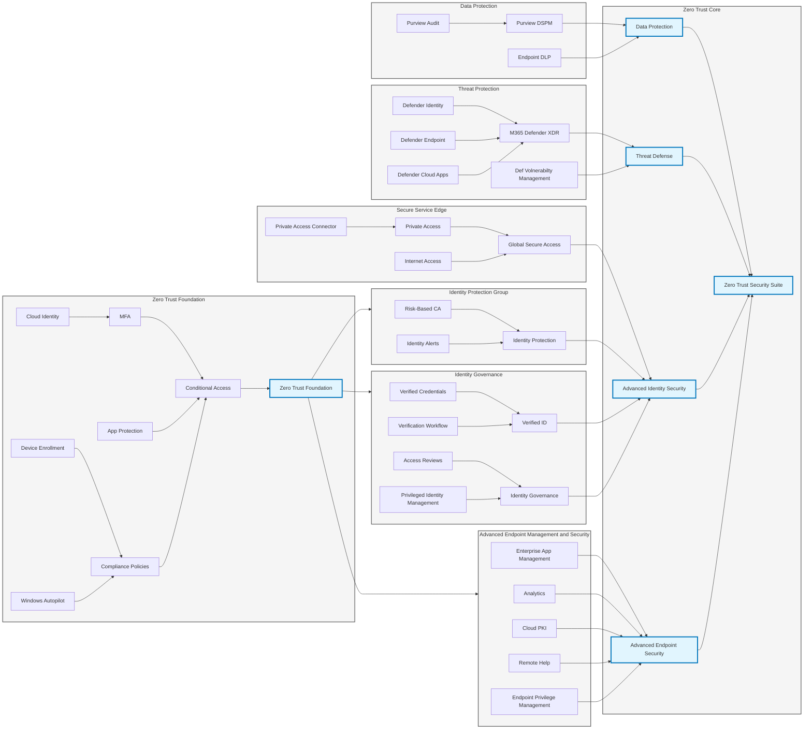

```mermaid        
           
            flowchart LR
                %% Define core components with clear labels
                    subgraph Core["Zero Trust Core"]
                    Zero["Zero Trust Security Suite"]
                    Data["Data Protection"]
                    Threats["Threat Defense"]
                    SecureID["Advanced Identity Security"]
                    IntuneSuite["Advanced Endpoint Security"]
                    end

                %% Core relationships
                    Data --> Zero
                    Threats --> Zero
                    SecureID --> Zero
                    IntuneSuite --> Zero

                    %% Add click events for core components
                    click Zero "https://learn.microsoft.com/en-us/security/zero-trust/zero-trust-overview" _blank
                    click Data "https://learn.microsoft.com/en-us/purview/data-protection" _blank
                    click Threats "https://learn.microsoft.com/en-us/microsoft-365/security/defender/microsoft-365-defender" _blank
                    click SecureID "https://learn.microsoft.com/en-us/entra/identity/identity-overview-azure-portal" _blank
                    click IntuneSuite "https://learn.microsoft.com/en-us/mem/intune/fundamentals/what-is-intune" _blank

                %% Group Data Security components
                        subgraph DataProtection["Data Protection"]
                        direction TB
                        DSPM["Purview DSPM"]
                        EndpointDLP["Endpoint DLP"]
                        PurAud["Purview Audit"]
                        end
                DSPM --> Data
                EndpointDLP --> Data
                PurAud --> DSPM

                %% Add click events for Data Protection components
                click DSPM "https://learn.microsoft.com/en-us/purview/data-security-posture-management" _blank
                click EndpointDLP "https://learn.microsoft.com/en-us/purview/endpoint-dlp-learn-about" _blank
                click PurAud "https://learn.microsoft.com/en-us/purview/audit-solutions-overview" _blank

                %% Group Threat Protection components
                subgraph ThreatProtection["Threat Protection"]
                    direction TB
                    XDR["M365 Defender XDR"]
                    DID["Defender Identity"]
                    MDE["Defender Endpoint"]
                    MDCA["Defender Cloud Apps"]
                    MDVM["Def Volnerabilty Management"]
                end
                XDR --> Threats
                DID --> XDR
                MDE --> XDR
                MDCA --> XDR
                MDVM --> Threats

                %% Add click events for Threat Protection components
                click XDR "https://learn.microsoft.com/en-us/microsoft-365/security/defender/microsoft-365-defender" _blank
                click DID "https://learn.microsoft.com/en-us/defender-for-identity/what-is" _blank
                click MDE "https://learn.microsoft.com/en-us/microsoft-365/security/defender-endpoint/microsoft-defender-endpoint" _blank
                click MDCA "https://learn.microsoft.com/en-us/defender-cloud-apps/what-is-defender-for-cloud-apps" _blank
                click MDVM "https://learn.microsoft.com/en-us/defender-vulnerability-management/" _blank

                %% Group Foundation components
                subgraph Foundationcomponents["Zero Trust Foundation"]
                    direction TB
                    Foundation["Zero Trust Foundation"]
                    CloudID["Cloud Identity"] --> MFA["MFA"]
                    MFA --> CA["Conditional Access"]
                    IntuneEnroll["Device Enrollment"] --> IntuneCompPol["Compliance Policies"]
                    AppProtection["App Protection"] --> CA
                    AutoPilot["Windows Autopilot"] --> IntuneCompPol
                    IntuneCompPol --> CA
                    CA --> Foundation
                end
                Foundation --> IdentityProtectiongroup
                Foundation --> IdentityGovernance
                Foundation --> EndpointManagement

                %% Add click events for Foundation components
                click Foundation "https://learn.microsoft.com/en-us/security/zero-trust/zero-trust-overview" _blank
                click CloudID "https://learn.microsoft.com/en-us/entra/fundamentals/whatis" _blank
                click MFA "https://learn.microsoft.com/en-us/entra/identity/authentication/concept-mfa-howitworks" _blank
                click CA "https://learn.microsoft.com/en-us/entra/identity/conditional-access/overview" _blank
                click IntuneEnroll "https://learn.microsoft.com/en-us/mem/intune/enrollment/" _blank
                click IntuneCompPol "https://learn.microsoft.com/en-us/mem/intune/protect/device-compliance-get-started" _blank
                click AppProtection "https://learn.microsoft.com/en-us/mem/intune/apps/app-protection-policies" _blank
                click AutoPilot "https://learn.microsoft.com/en-us/mem/autopilot/windows-autopilot" _blank

                %% Group Network Access components
                subgraph NetworkAccess["Secure Service Edge"]
                    direction TB
                    EPA["Private Access"]
                    EPAConn["Private Access Connector"]
                    GSA["Global Secure Access"]
                    EIA["Internet Access"]
                end
                EPAConn --> EPA
                EPA --> GSA
                GSA --> SecureID
                EIA --> GSA

                %% Add click events for Network Access components
                click EPA "https://learn.microsoft.com/en-us/entra/identity/private-access/private-access-overview" _blank
                click EPAConn "https://learn.microsoft.com/en-us/entra/identity/private-access/deployment-guide" _blank
                click GSA "https://learn.microsoft.com/en-us/entra/global-secure-access/overview" _blank
                click EIA "https://learn.microsoft.com/en-us/entra/internet-access/overview" _blank

                %% Group Identity Protection components
                subgraph IdentityProtectiongroup["Identity Protection Group"]
                    RCA["Risk-Based CA"] --> IDProtection["Identity Protection"]
                    IDProtAlerts["Identity Alerts"] --> IDProtection                                   
                end
                IDProtection --> SecureID

            
                %% Add click events for Identity Protection components
                click RCA "https://learn.microsoft.com/en-us/entra/identity/conditional-access/howto-conditional-access-policy-risk" _blank
                click IDProtection "https://learn.microsoft.com/en-us/entra/id-protection/overview-identity-protection" _blank
                click IDProtAlerts "https://learn.microsoft.com/en-us/entra/id-protection/howto-identity-protection-configure-notifications" _blank

                %% Group Identity Governance components
                subgraph IdentityGovernance["Identity Governance"]
                    direction TB
                    VIDCred["Verified Credentials"]
                    VIDWorkflow["Verification Workflow"]
                    VID["Verified ID"]
                    AccessReview["Access Reviews"]
                    IGA["Identity Governance"]
                    PIM["Privileged Identity Management"]
                end
                VIDCred --> VID
                VIDWorkflow --> VID
                VID --> SecureID
                AccessReview --> IGA
                PIM --> IGA
                IGA --> SecureID

                %% Add click events for Identity Governance components
                click VIDCred "https://learn.microsoft.com/en-us/entra/verified-id/verifiable-credentials-configure" _blank
                click VIDWorkflow "https://learn.microsoft.com/en-us/entra/verified-id/verifiable-credentials-configure-workflow" _blank
                click VID "https://learn.microsoft.com/en-us/entra/verified-id/overview" _blank
                click AccessReview "https://learn.microsoft.com/en-us/entra/id-governance/access-reviews-overview" _blank
                click IGA "https://learn.microsoft.com/en-us/entra/id-governance/" _blank
                click PIM "https://learn.microsoft.com/en-us/entra/id-governance/privileged-identity-management/pim-configure" _blank

                %% Group Endpoint Management components
                subgraph EndpointManagement["Advanced Endpoint Management and Security"]
                    direction TB
                    EndpointAnalytics["Analytics"]
                    RemoteHelp["Remote Help"]
                    EPM["Endpoint Privilege Management"]
                    AppManagement["Enterprise App Management"]
                    Cloudpki["Cloud PKI"]
                end

                AppManagement --> IntuneSuite
                EndpointAnalytics --> IntuneSuite
                Cloudpki --> IntuneSuite
                RemoteHelp --> IntuneSuite
                EPM --> IntuneSuite

                

                %% Add click events for Endpoint Management components
                click EndpointAnalytics "https://learn.microsoft.com/en-us/mem/analytics/" _blank
                click RemoteHelp "https://learn.microsoft.com/en-us/mem/intune/remote-actions/remote-help" _blank
                click EPM "https://learn.microsoft.com/en-us/mem/intune/protect/endpoint-privilege-management" _blank
                click AppManagement "https://learn.microsoft.com/en-us/mem/intune/apps/app-management" _blank
                click Cloudpki "https://learn.microsoft.com/en-us/mem/intune/protect/microsoft-cloud-pki-overview" _blank

                %% Styling
                classDef deployed fill:#90EE90,stroke:#333,stroke-width:2px
                classDef notDeployed fill:#FFB6C1,stroke:#333,stroke-width:2px
                classDef subgraphStyle fill:#f5f5f5,stroke:#666,stroke-width:2px
                classDef core fill:#e1f5fe,stroke:#0277bd,stroke-width:3px

                %% Apply styles
                class Core,DataProtection,ThreatProtection,IdentityProtection,NetworkAccess,IdentityGovernance,EndpointManagement,IdentityProtectiongroup,IdentityGovernance,Foundationcomponents, subgraphStyle
                class Zero,Foundation,Data,Threats,SecureID,IntuneSuite core

```
